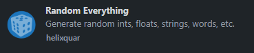
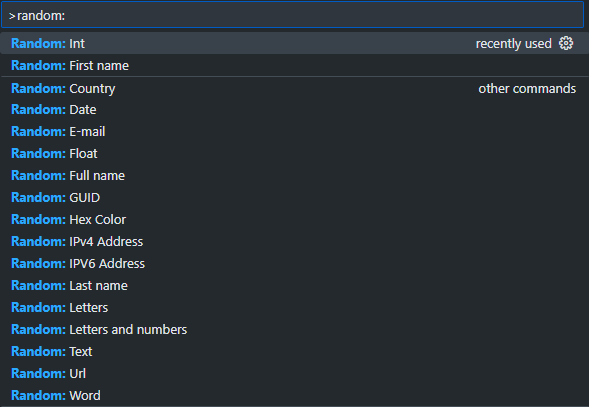
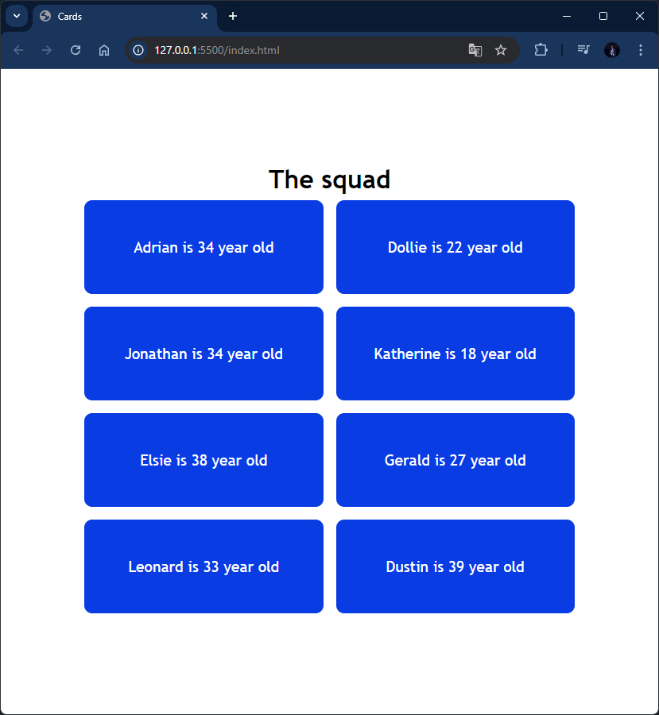

# 🃏 Dynamic Cards Display

A simple web page that dynamically displays cards with data fetched from a JavaScript array. The rendering of the cards is done entirely using **JavaScript**, without hardcoding the card structure in the HTML. This project is based on a tutorial from [Brian Design](https://www.youtube.com/@briandesign).

## 🚀 Features

-   Dynamically renders a list of cards from a JavaScript array.
-   Each card displays information such as a title, description, and image.
-   Clean and responsive design using **HTML** and **CSS**.

## 🛠️ Technologies Used

-   **HTML**: Basic structure of the page.
-   **CSS**: Styling for the layout and cards.
-   **JavaScript**: Logic for dynamically generating the cards from an array of data.

## 📋 Usage

1. Clone the repository:

    ```bash
    git clone https://github.com/viorelss/dynamic-cards.git
    ```

2. Open the `index.html` file in your browser to view the dynamically generated cards.

## 🎥 Tutorial Reference

This project follows the tutorial by **Brian Design**:

-   YouTube Tutorial: [Build 3 Beginner Javascript Projects in 30 mins Tutorial - HTML, CSS & JS](https://www.youtube.com/watch?v=mCQ1-iDSnto&t=53s)

## 🌐 Deployment

The project has been deployed using **GitHub Pages** and can be accessed [here](https://viorelss.github.io/JS_Cards).

## 🤝 Contributing

Contributions are welcome! If you'd like to enhance the project or fix bugs, feel free to fork the repository, create a new branch, and submit a pull request.

1. Fork the project.
2. Create a new branch (`git checkout -b feature/YourFeature`).
3. Commit your changes (`git commit -m 'Add new feature'`).
4. Push to the branch (`git push origin feature/YourFeature`).
5. Open a pull request.

---

## PRO TIP

To generate dummy data I used [Random Everything](https://www.youtube.com/watch?v=mCQ1-iDSnto&t=53s) extension in VS Code.

<div align="center">
    
    
</div>

### 🖼️ Project Screenshot

<div align="center">
  
</div>
